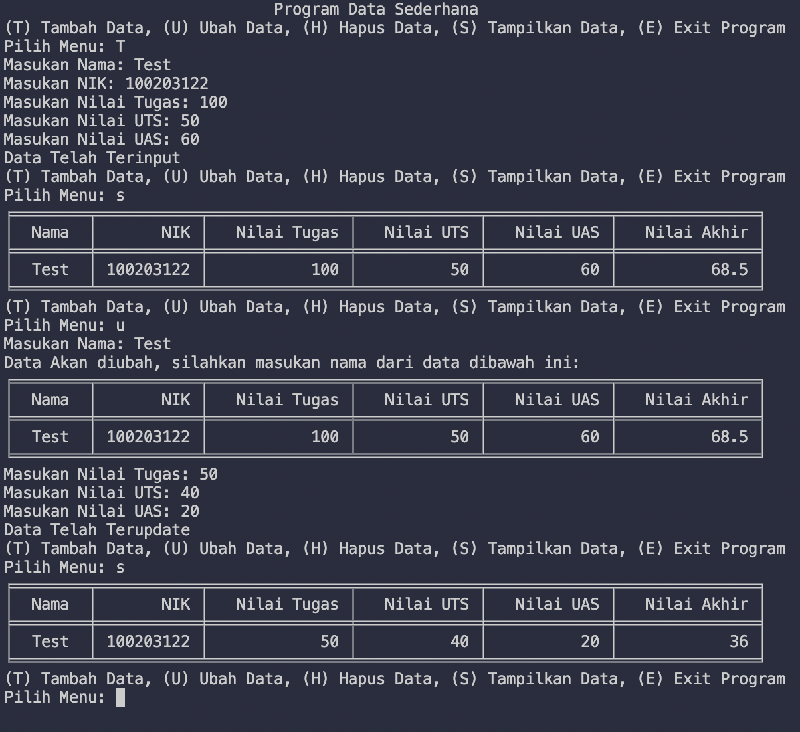
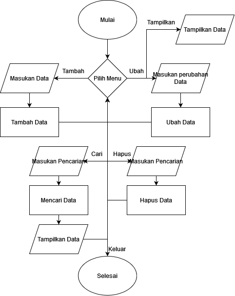

# <p align="center"> TUGAS PEMROGRAMAN Pertemuan 12 

```sh
Nama: Widiya Setiyaningrum
NIM: 312110530
```

<br>


# [Main.py]

<p align="justify">Program Data sederhana menggunakan Function, List & Dictionary dengan menu Tambah, Ubah, Tampilkan, Hapus, dan Cari.

- Import class Method dan memanggil class tersebut.
```sh
from method import *;

method = method(); 
```
- Menggunakan perulangan While, selama masih true maka program akan tetap berjalan.
```sh
while (True):
```
- Menggunakan If Else untuk menentukan menu.
```sh
if inputs == 't':
```
- Memanggil function yang berada di class Method.
```sh
method.ubah(inputNamaUpdate);
```
----

# [Method.py]

<p align="justify">Berisi daftar function yang dipakai pada class Main.

- Import Tabulate untuk membuat table.
```sh
from tabulate import tabulate; 
```
- Membuat List dengan Dictionary.
```sh
datas = [{
    'nama' : 'No Data Found!'    
    }];
```
- Membuat class.
```sh
class method:
```
- Membuat function dengan parameter Self.
```sh
   def tampilkan(self):
        if datas[0]['nama'] == 'No Data Found!':
            print(tabulate([datas], tablefmt='fancy_grid', stralign='center'));
        else:
            rows =  [x.values() for x in datas];
            headers = ['Nama', 'NIK', 'Nilai Tugas', 'Nilai UTS', 'Nilai UAS', 'Nilai Akhir'];
            print(tabulate(rows, headers=headers, tablefmt='fancy_grid', stralign='center'));
            
```
----

# Hasil Output


# Flowchart


